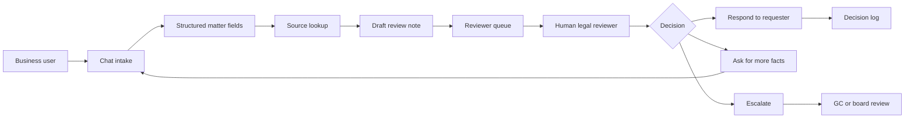

# GC Copilot architecture

Educational architecture sketch for a supervised internal legal operations chatbot.

## Product goal

The chatbot should make legal intake easier for the business and more structured for the legal team. It should collect facts, identify missing information and route matters to a reviewer.

## Source layer

A production version could connect to approved policies, legal sources and playbooks through a permissioned retrieval layer or MCP server.

## Limitation

Educational architecture diagram only. It is not legal advice or production implementation guidance.
